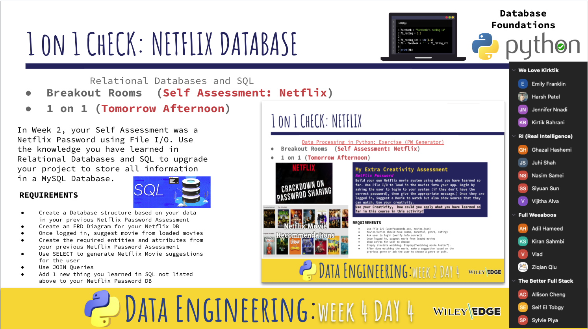
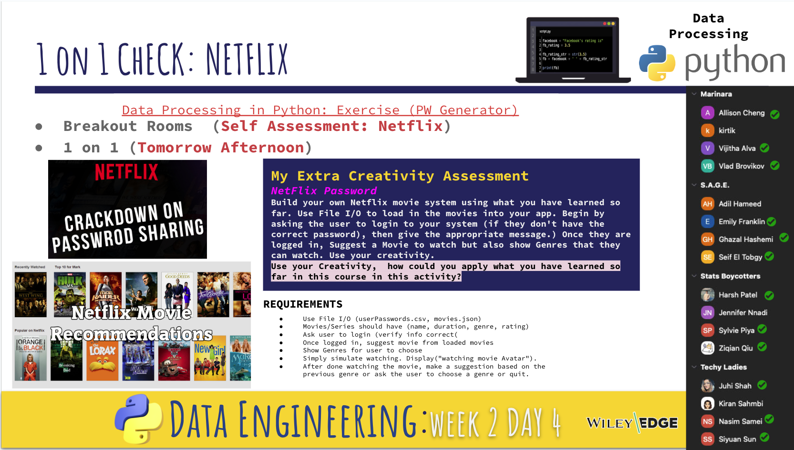

# Relational Databases & SQL
In a software environment, databases (relational or not) are preferable to files because they can store data separately from the application itself, often on a completely separate server. While this might slow down access to the data to a small degree, the fact that they are separate means that multiple applications can access the same database, and that changes to the data in the database are immediately accessible to any application that uses that data.

## Lessons
By the end of this course, participants will be able to build a python foundation by following these lesson:

**NOTE: Do Not Turn In Lesssons. These are for building your foundation to complete the exercises and activities**

- [Lesson: Normalize he Vinyl Record Shop Database](https://academy.engagelms.com/mod/book/view.php?id=147449)
- [Lesson: Build the Vinyl Record Shop Database](https://academy.engagelms.com/mod/book/view.php?id=147464)
- [Lesson: Add Data to the Vinyl Record Shop Database](https://academy.engagelms.com/mod/book/view.php?id=147477)

## TURN IN ASSIGNMENTS
The assignment for Python are jupyter notbooks provided to you. You will turn in your notebooks in the appropciate sections. **Turn in** your  *Activities*, *Exercises*, and *Self Assessment* code in the 

Below are the assignments to turn in. Add your Jupyter Notebooks from the following lessons:

### Activities
- [Activityies: Python and MySQL](https://academy.engagelms.com/mod/page/view.php?id=147763)

### Exercises
- [Exercise: Books Database DDL](https://academy.engagelms.com/mod/page/view.php?id=147465)
- [Exercise: Movies Database DDL](https://academy.engagelms.com/mod/page/view.php?id=147466)
- [Exercise: DDL](https://academy.engagelms.com/mod/page/view.php?id=147467)
- [Exercise: SELECT Queries](https://academy.engagelms.com/mod/page/view.php?id=147480)
- [Exercise: JOIN Queries](https://academy.engagelms.com/mod/page/view.php?id=147482)
- [Exercise: Grouoping and Sorting](https://academy.engagelms.com/mod/page/view.php?id=147485)
- [Exercise: World Database](https://academy.engagelms.com/mod/page/view.php?id=147486)
- [Exercise: Python and MySQL](https://academy.engagelms.com/mod/page/view.php?id=147983)

### Quizzes
- [Quiz: Relational Database Design](https://academy.engagelms.com/mod/quiz/view.php?id=147451)
- [Quiz: Data Definition Language - DDL](https://academy.engagelms.com/mod/quiz/view.php?id=147468)
- [Quiz: Data Manipulation Language - DML](https://academy.engagelms.com/mod/quiz/view.php?id=147487)
- [Summative Quiz: Relational Databases & MySQL](https://academy.engagelms.com/mod/quiz/view.php?id=147494)

### Self Assessment 
- **My Challenge: Extra Assessment**: *Netflix App* - Create a database schema for your previous Netflix App. Create and add data to the the database in using MySQL Workbench. 
- **Week4 Assessment: Netflix Password - SQL DB**

**Week2 Assessment: Netflix Password - File I/O**
